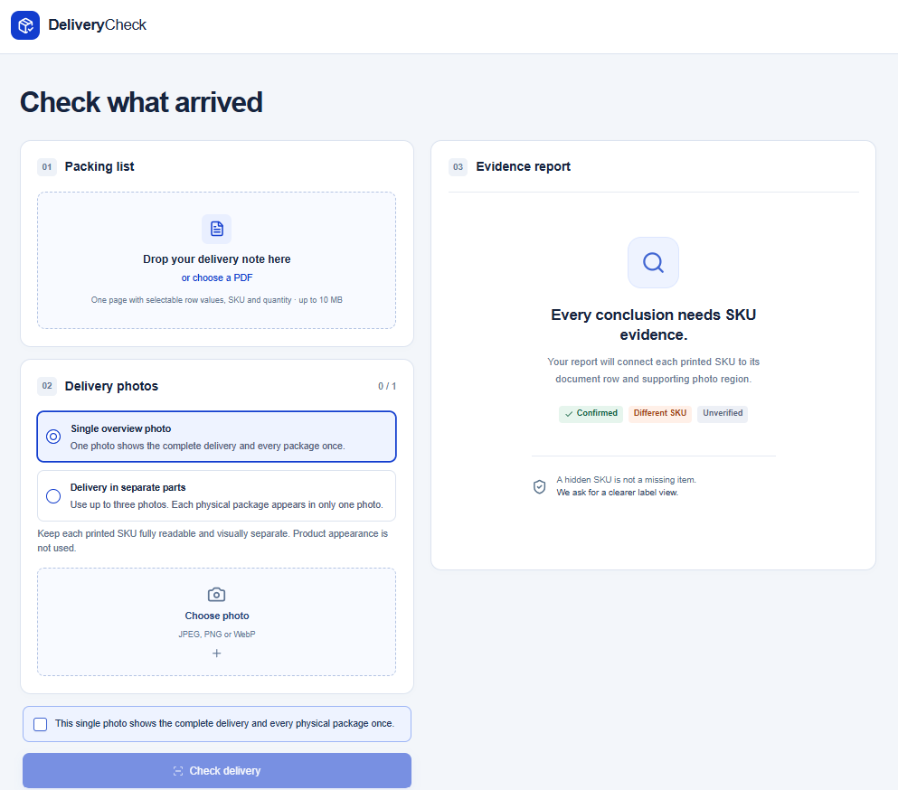
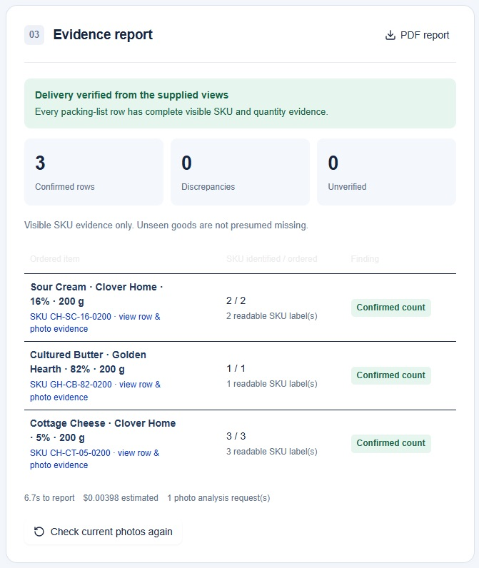
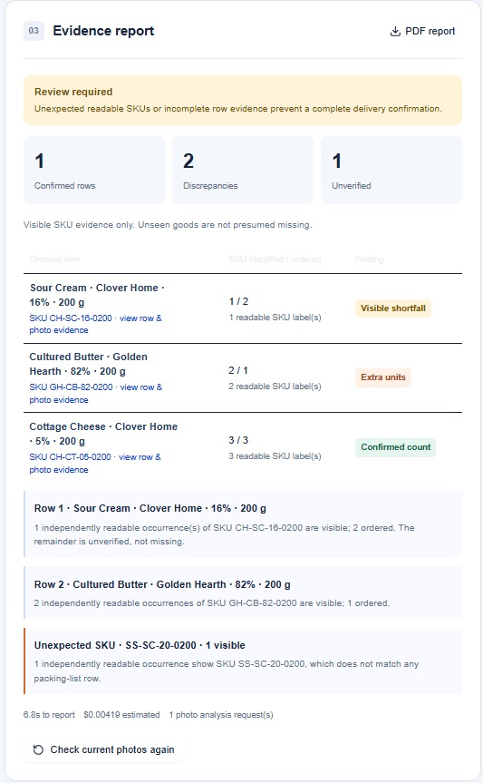

# DeliveryCheck

**AI-powered delivery verification using packing lists and photographic SKU evidence.**
**Live demo:** https://delivery-check-gamma.vercel.app/

DeliveryCheck is a browser-based prototype that compares a delivery note with photographs of received goods. It identifies independently readable printed SKU labels, compares their quantities against the document, and generates an evidence-based verification report.

The application is designed for a small, controlled delivery-verification workflow rather than general-purpose retail product recognition.

## Screenshots

### Delivery setup


### Verified delivery


### Delivery with discrepancies


## Features

- Upload a one-page, text-based PDF packing list.
- Analyze up to five product types and three photographs per delivery.
- Identify printed SKU labels using AI vision.
- Verify product identity and visible quantities.
- Detect extra units and unexpected SKUs.
- Mark insufficiently supported quantities as unverified rather than missing.
- Link findings to document rows and photographic evidence regions.
- Generate a report with processing time and estimated API cost.
- Export results using the browser's Print / Save as PDF functionality.

## How It Works

1. Upload a delivery note in PDF format.
2. Choose a photograph mode:
   - **Single overview photo:** One image shows the complete delivery, with each physical item appearing once.
   - **Delivery in separate parts:** Up to three images show different, non-overlapping sections of the same delivery.
3. Upload the photographs and confirm the capture convention.
4. Click **Check delivery**.
5. Review the findings and supporting evidence.

### Verification Approach

DeliveryCheck uses a SKU-first approach.

The AI model extracts independently readable printed SKU occurrences from the photographs. The application then validates and compares those observations against the parsed packing list using deterministic reconciliation logic.

Product appearance alone is not accepted as proof of identity.

If a label is obscured, unreadable or outside the camera view, its corresponding quantity remains unverified. The application does not claim that an item is missing simply because its SKU was not observed.

In Separate Parts mode, each physical item must appear in only one photograph. Cross-photo object tracking is outside the prototype's scope.

## Technology

- Next.js
- React and TypeScript
- OpenAI Responses API
- GPT-5.4 mini for visual SKU extraction
- PDF.js for packing-list text extraction
- Vercel for deployment

The OpenAI API key is used only on the server.

## Local Setup

**Requirements:**
- Node.js 22.13 or newer
- npm
- OpenAI API key

Clone the repository and install dependencies:

```bash
git clone https://github.com/quttaj/delivery-check.git
cd delivery-check
npm install
```

Create `.env.local` using `.env.example` as a template.

Set your API key and model:

```env
OPENAI_API_KEY=your_api_key_here
OPENAI_MODEL=gpt-5.4-mini
```

Start the development server:

```bash
npm run dev
```

Open http://localhost:3000.

### Verification Commands

```bash
npm test
npm run typecheck
npm run build
```

Automated tests use mocked model responses and do not require paid AI requests.

## Test Samples

The [`test-samples`](./test-samples) directory contains controlled delivery notes and photographs for reproducing the verification scenarios.

It includes examples of correct deliveries, quantity discrepancies, unexpected SKUs, incomplete visual evidence, and deliveries photographed in separate parts.

The application processes uploaded inputs dynamically. Results are not hardcoded for the sample files.

## Limitations

- Printed SKU labels must be sufficiently readable.
- AI-generated evidence regions are approximate and may not align perfectly with the printed text.
- Unreadable labels cannot confirm product identity or quantity.
- Separate Parts mode requires non-overlapping photographs to prevent double-counting.
- Individual image uploads are subject to deployment request-size limits.
- Recognition accuracy can vary with image quality, lighting and label visibility.

Warehouse integrations, supplier complaints and general-purpose object recognition are outside the prototype's scope.

## Project Status

Functional prototype developed as a Product Builder technical assignment.

The source code, controlled test materials and verification logic are provided for review and reproduction.
